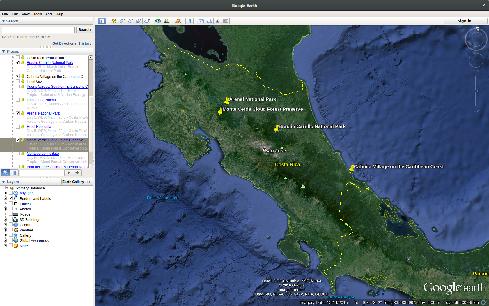
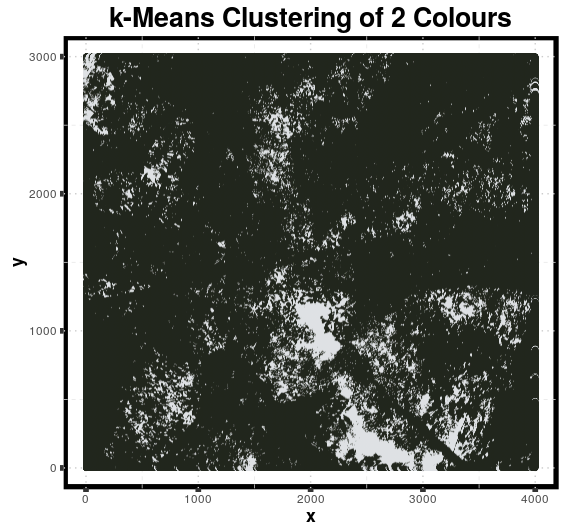
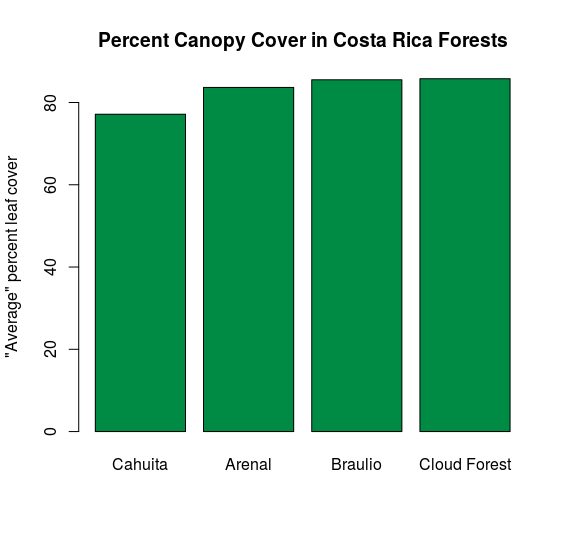

# Canopy Cover Assessment in Costa Rica Forests using Hemispherical Photography

The above map shows the four regions considered for analysis.

The above image is the result of running the R built in kmeans clustering algorithm looking for 2 centers (leaf or sky). The algorithm seems to be very good at picking out leaf from not leaf.

From the above plot, I found that Cahuita had the lowest canopy cover of all, but all the forests were pretty much the same in general. The canopy cover in Costa Rica is very high and very consistent among different geographic regions.

[Presentation Link](https://goo.gl/KvtCwG)
